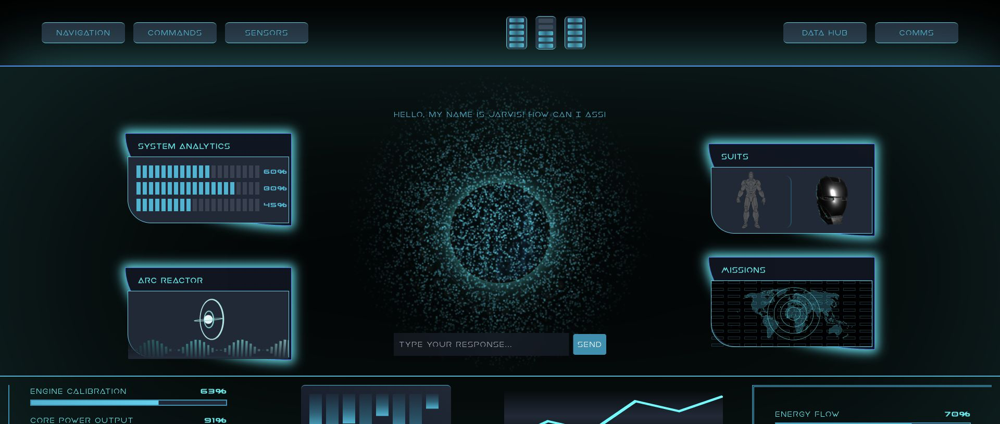

# Jarvis AI Executive Dashboard

Paperclip Intelligence Platform — Vite + React + TypeScript SPA deployed on Vercel with serverless API proxies for Paperclip, Gmail, Google Calendar, and Obsidian Brain.

## Main page



## Wiring live data

All four panels (AGENTS, EMAIL, CALENDAR, BRAIN) fall back to demo data when their Vercel env vars are absent. To enable live data:

1. Copy `.env.example` to `.env.local` and fill in your values.
2. See the full wiring dossier in [APPU-622](https://paperclip.billyrovzar.com/APPU/issues/APPU-622) for step-by-step instructions covering:
   - Google OAuth2 refresh-token setup (Phases 2 + 3)
   - Cloudflare Tunnel for Obsidian (Phase 3)
   - Vercel env var deployment via API (Phase 5)

**Quick env var reference:**

| Variable | Purpose |
|---|---|
| `VITE_PAPERCLIP_API_URL` | `https://paperclip.billyrovzar.com` |
| `PAPERCLIP_API_URL` | same as above (server-side) |
| `VITE_PAPERCLIP_COMPANY_ID` | APPU company UUID |
| `PAPERCLIP_API_KEY_DA1766D2` | Paperclip API key for APPU |
| `GOOGLE_CLIENT_ID` | Google OAuth2 client ID |
| `GOOGLE_CLIENT_SECRET` | Google OAuth2 client secret |
| `GOOGLE_REFRESH_TOKEN` | Long-lived refresh token (Gmail + Calendar) |
| `OBSIDIAN_API_URL` | `https://obsidian.billyrovzar.com` (via Cloudflare Tunnel) |
| `OBSIDIAN_API_KEY` | Obsidian Local REST API key |

---

## Development

```bash
npm install
npm run dev
```

---

# Vite template notes

Currently, two official plugins are available:

- [@vitejs/plugin-react](https://github.com/vitejs/vite-plugin-react/blob/main/packages/plugin-react) uses [Oxc](https://oxc.rs)
- [@vitejs/plugin-react-swc](https://github.com/vitejs/vite-plugin-react/blob/main/packages/plugin-react-swc) uses [SWC](https://swc.rs/)

## React Compiler

The React Compiler is not enabled on this template because of its impact on dev & build performances. To add it, see [this documentation](https://react.dev/learn/react-compiler/installation).

## Expanding the ESLint configuration

If you are developing a production application, we recommend updating the configuration to enable type-aware lint rules:

```js
export default defineConfig([
  globalIgnores(['dist']),
  {
    files: ['**/*.{ts,tsx}'],
    extends: [
      // Other configs...

      // Remove tseslint.configs.recommended and replace with this
      tseslint.configs.recommendedTypeChecked,
      // Alternatively, use this for stricter rules
      tseslint.configs.strictTypeChecked,
      // Optionally, add this for stylistic rules
      tseslint.configs.stylisticTypeChecked,

      // Other configs...
    ],
    languageOptions: {
      parserOptions: {
        project: ['./tsconfig.node.json', './tsconfig.app.json'],
        tsconfigRootDir: import.meta.dirname,
      },
      // other options...
    },
  },
])
```

You can also install [eslint-plugin-react-x](https://github.com/Rel1cx/eslint-react/tree/main/packages/plugins/eslint-plugin-react-x) and [eslint-plugin-react-dom](https://github.com/Rel1cx/eslint-react/tree/main/packages/plugins/eslint-plugin-react-dom) for React-specific lint rules:

```js
// eslint.config.js
import reactX from 'eslint-plugin-react-x'
import reactDom from 'eslint-plugin-react-dom'

export default defineConfig([
  globalIgnores(['dist']),
  {
    files: ['**/*.{ts,tsx}'],
    extends: [
      // Other configs...
      // Enable lint rules for React
      reactX.configs['recommended-typescript'],
      // Enable lint rules for React DOM
      reactDom.configs.recommended,
    ],
    languageOptions: {
      parserOptions: {
        project: ['./tsconfig.node.json', './tsconfig.app.json'],
        tsconfigRootDir: import.meta.dirname,
      },
      // other options...
    },
  },
])
```
